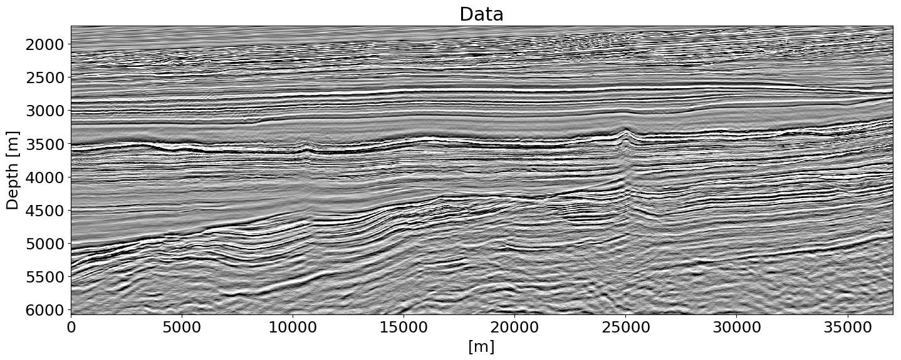
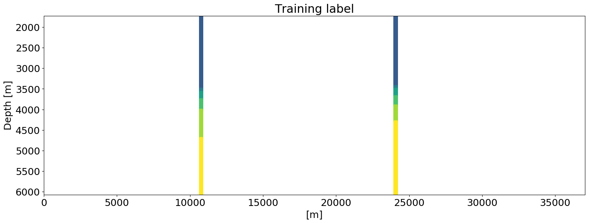
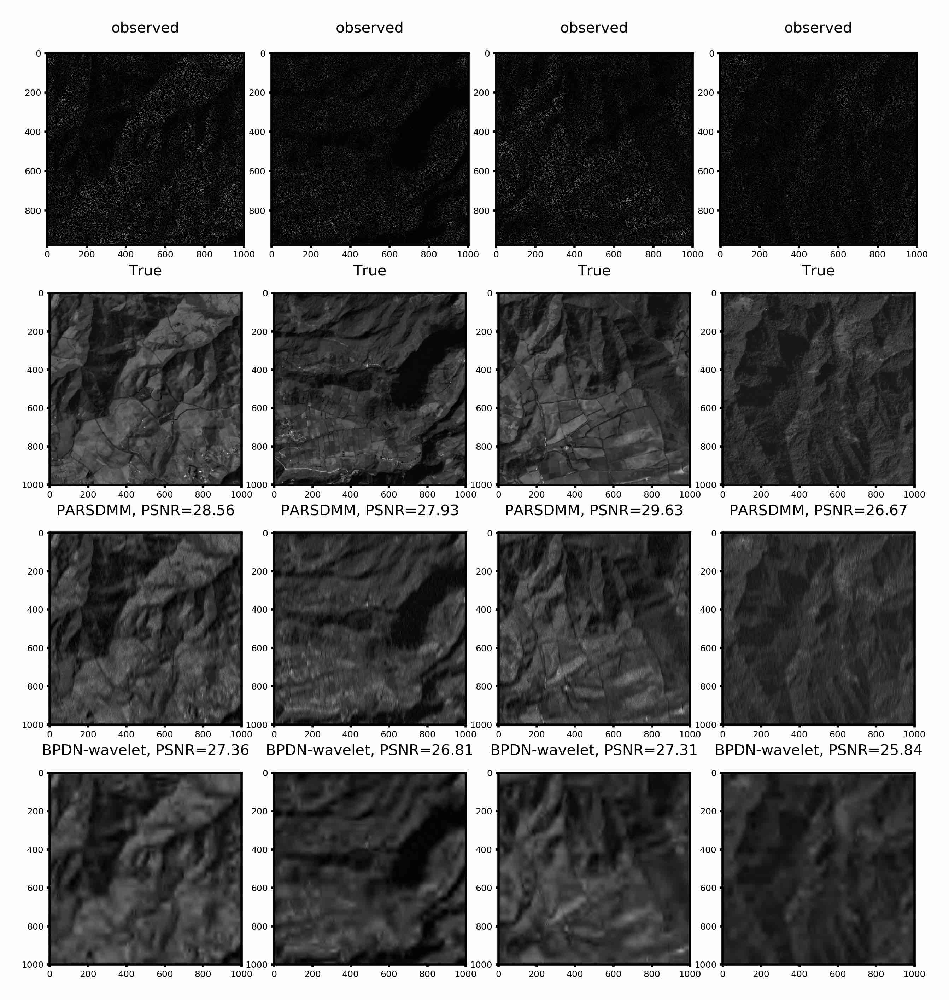

Bas Peters

PhD, University of British Columbia (2019)
MSc and BSc, Utrecht University, The Netherlands 
[LinkedIn](https://www.linkedin.com/in/bas-peters-b26ba3a/) | [Google Scholar](https://scholar.google.ca/citations?user=gPVDmBEAAAAJ&hl=en&oi=ao) | [GitHub](https://github.com/PetersBas)

Hi! I am a visiting assistant professor in the mathematics department at Emory University. Previously, I worked for [Computational Geosciences Inc.](http://www.compgeoinc.com). I was a graduate student in the [SLIM](http://slim.gatech.edu) group at the University of British Columbia (currently at Georgia Tech). My research interests include 
*i*) computational methods to design and train neural networks for large scale inputs; 
*ii)* constrained optimization for the regularization of inverse problems and neural networks; 
*iii*) applications in the geosciences and remote sensing.

## Teaching
Emory University: [Linear Algebra MATH221](https://www.coursicle.com/emory/professors/Bas+Peters/) (all class info on Canvas)

## Publications
Please see my [scholar page.](https://scholar.google.ca/citations?user=gPVDmBEAAAAJ&hl=en&oi=ao)

## Recent presentations (2019)
### Upcoming:
- [The Weaker the Better: Weak Supervision for Training Neural Networks for Seismic Interpretation; an Approach via Constrained Optimization](https://www.gshtx.org/SharedContent/Events/Event_Display.aspx?EventKey=16ba1771-dc38-4322-a813-a17c94463b49&WebsiteKey=955f17e6-46ad-4401-acbd-2af6c393752b); [Data Science and Machine Learning special interest group Geophysical Society of Houston. October 28, 2020]
- [Scientific Computing Seminar, Emory University](http://www.mathcs.emory.edu/site/scicomp/schedule/); Oct 16, 2020.
- A vision approach to mineral prospectivity mapping using reversible neural networks [Workshop on Machine Learning/Artificial Intelligence in Mineral Exploration; Society of Exploration Geophysicists Annual Meeting; Thursday, Oct 15, 2020]
- Shortcutting inversion-based near-surface characterization workflows using deep learning [Special Session on Machine Learning in the Near Surface; Society of Exploration Geophysicists Annual Meeting; Oct 13, 2020]

### Past:

- Novel deep learning architectures and problem formulations for the geosciences. Department of Earth, Ocean and Atmospheric Sciences Seminar; University of British Columbia. Monday, March 9, 2020.
- Scientific Computing, Applied and Industrial Mathematics (SCAIM) Seminar Series, UBC, October 29 2019 [slides](https://www.slideshare.net/BasPeters11/learning-from-a-few-largescale-partial-examples-computational-tools-regularization-and-network-design?qid=63f82a0e-9ee2-4a61-8cbb-94cb844e9a00&v=&b=&from_search=1)
- Does shallow geological knowledge help neural-networks to predict deep units? [Society of Exploration Geophysicists, Annual meeting 2019]
- A numerical solver for least-squares sub-problems in 3D wavefield reconstruction inversion and related problem formulations [Society of Exploration Geophysicists, Annual meeting 2019]
- Automatic classification of geologic units in seismic images using partially interpreted examples [81st EAGE Conference and Exhibition 2019]
- Generalized Minkowski sets for the regularization of inverse problems (SIAM Conference on Mathematical and Computational Issues in the Geosciences, 2019) [video](https://www.pathlms.com/siam/courses/11267/sections/14618/video_presentations/128671) [slides](https://cdn.fs.pathlms.com/WpyqzDxDQmazQeMb3KRu)
- Networks, loss-functions, regularization, and software for machine learning in the geosciences [Machine learning in solid earth geoscience, hosted by Los Alamos National Laboratory in Santa Fe, 2019]

## Computational methods and design of deep neural networks
Collaborators: Keegan Lensink & Eldad Haber. Research focusses on developing new networks that require less memory for weights and for network states while computing gradients of loss functions.

:Overview of the design of HyperNet. Memory consumption of various networks on the right.

[Fully Hyperbolic Convolutional Neural Networks](https://arxiv.org/pdf/1905.10484)
[Symmetric block-low-rank layers for fully reversible multilevel neural networks](https://arxiv.org/abs/1912.12137)

## Deep-learning based computer vision for geoscience applications
Collaborators: Eldad Haber & Justin Granek. For this project we develop methods to be able to apply deep neural-networks to geoscience problems. We worked on techniques to deal with *i)* data with sparse labels *ii)* including prior knowledge via regularization of the output of a network while training, in order to mitigate a lack of labels. 

:Semantic segmentation of seismic images into lithological units of interest. Training data are slices from a 3D volume. There are 24 training images that each have 2 associated boreholes. This result uses regularization of the network output to mitigate the lack of labeled data.

[Automatic Classification of Geologic Units in Seismic Images Using Partially Interpreted Examples](http://www.earthdoc.org/publication/publicationdetails/?publication=97269) / [arXiv](https://arxiv.org/pdf/1901.03786)

[Neural-networks for geophysicists and their application to seismic data interpretation](https://library.seg.org/doi/10.1190/tle38070534.1) / [arXiv](https://arxiv.org/pdf/1903.11215)

[Does shallow geological knowledge help neural-networks to predict deep units?](https://library.seg.org/doi/10.1190/segam2019-3216640.1) / [arXiv](https://arxiv.org/pdf/1904.04413)

:Detecting horizons (interfaces) of interest in seismic images. There are a number of training images and each has a few labels (seed points). Our method performs better than methods not based on learning, especially in areas where there are large gaps in the labels.

[Multiresolution neural networks for tracking seismic horizons from few training images](https://library.seg.org/doi/10.1190/INT-2018-0225.1) / [arXiv](https://arxiv.org/pdf/1812.11092)

## Constrained optimization for regularizing imaging inverse problems
Collaborator: Felix J. Herrmann. 

We incorporate prior knowledge into the inverse problems via a projection of a vector onto an intersection of multiple convex and non-convex sets. Each sets may include a different linear operator, such as discrete derivative matrices, Fourier/DCT/wavelet/curvelet transforms. The projection approach has the advantage that each sets is defined independently of all others; no trade-off/balancing parameters are required. Julia software is available as the [SetIntersectionProjection](https://petersbas.github.io/SetIntersectionProjectionDocs/) package.

:Reconstructing images from noisy, blurred, and missing pixels. Shows basis-pursuit denoise using wavelets, versus our method (PARSDMM): projection onto an intersection of constraint sets that were learned from examples.

 - [Algorithms and software for projections onto intersections of convex and non-convex sets with applications to inverse problems (preprint)](https://arxiv.org/pdf/1902.09699)
 - [Projection methods and applications for seismic nonlinear inverse problems with multiple constraints](https://library.seg.org/doi/abs/10.1190/geo2018-0192.1)
 - [Constraints versus penalties for edge-preserving full-waveform inversion](https://library.seg.org/doi/abs/10.1190/tle36010094.1) / [preprint](https://www.slim.eos.ubc.ca/Publications/Public/Journals/TheLeadingEdge/2016/peters2016cvp/peters2016cvp.pdf)
 - [Constrained Waveform Inversion of Colocated VSP and Surface Seismic Data](http://www.earthdoc.org/publication/publicationdetails/?publication=80659) / [preprint](https://www.slim.eos.ubc.ca/Publications/Public/Conferences/EAGE/2015/smithyman2015EAGEcwi/smithyman2015EAGEcwi.pdf)

In case it is difficult to describe a model/image using a set or intersection of sets as above, we can use an additive model. Therefore, we introduced a generalization of the Minkowski set, which allows us to construct a 'complicated' model/image from two 'simple' ones. We can add multiple pieces of prior knowledge about each component as well multiple constraints on their sum. In spirit, this approach generalized ideas from cartoon-texture decomposition, robust prinipal component analysis, and morphological component analysis. Julia software is available to set up constraints sets and compute the [projection onto the Generalized Minkowski Set](https://petersbas.github.io/GeneralizedMinkowskiSetDocs/).

:Segmentation of a greyscale video as the projection of the entire original video onto a generalized Minkowski set. Each of the components contain either a background or anomaly (moving people). 

[Generalized Minkowski sets for the regularization of inverse problems (preprint)](https://arxiv.org/pdf/1903.03942)

## Software

[SetIntersectionProjection](https://petersbas.github.io/SetIntersectionProjectionDocs/)

 - Julia, uses worker parallelism and multithreading
 - Simple way of setting up constraints. Software will provide a projector onto the intersection
 - Use projector for any suitable optimization problem
 - Contains example of full-waveform inversion, image inpainting/deblurring/denoising, image desaturation
 - Tested for computational domains of up to ``400^3``
 
 
[Generalized Minkowski Set projections](https://petersbas.github.io/GeneralizedMinkowskiSetDocs/)

 - This is an extension of SetIntersectionProjection
 - Build 'complicated' models from simple ones, via the addition and intersection of constraint sets
 - Software will provide a projector onto the Generalized Minkowski set
 - Contains examples of seismic full-waveform inversion and video segmentation.

## Numerical linear algebra and PDE-constrained optimization
Collaborators: Felix J. Herrmann & Tristan van Leeuwen
Under Construction