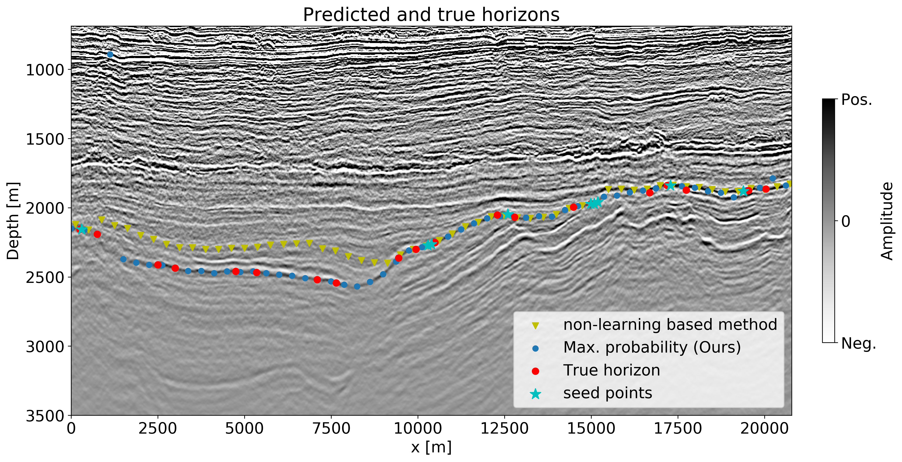

PhD, University of British Columbia (2019)\
MSc and BSc, Utrecht University, The Netherlands \
[LinkedIn](https://www.linkedin.com/in/bas-peters-b26ba3a/) | [Google Scholar](https://scholar.google.ca/citations?user=gPVDmBEAAAAJ&hl=en&oi=ao) | [GitHub](https://github.com/PetersBas)

Hi! I currently work for [Computational Geosciences Inc.](http://www.compgeoinc.com) where I research *i*) computational methods to design and train neural networks based on reversibility for large scale image-to-image or 3D-data-to-3D mappings; *ii*) Networks, loss functions, and regularization of deep networks for vision tasks in the earth sciences; *iii*) various deep-learning applications including: structural geological understanding of seismic images, generating structural geological maps and models from remote sensing, airborne geophysical, and prior geological knowledge; *iv*) development of a deep-learning toolbox for the aforementioned applications, which is also used for mineral prospectivity mapping and ground water mapping.

#### Table: {#interests}
|  Research projects | |
|--- |--- |
|[Computational methods and design of deep neural networks](#compnet) | [Computer vision for geoscience applications](#compvisgeo) |
|[Constrained optimization for regularizing imaging inverse problems](#constopt) | [Software](#soft) |
|[Numerical linear algebra and PDE-constrained optimization](#numlinalg) | [Assorted applications](#apps) |


##Publications #
Please see my [scholar page.](https://scholar.google.ca/citations?user=gPVDmBEAAAAJ&hl=en&oi=ao)

## Recent presentations (2019)
### Upcoming:
- Nothing scheduled at the moment.

### Past:
- Scientific Computing, Applied and Industrial Mathematics (SCAIM) Seminar Series, UBC, October 29 2019
- Does shallow geological knowledge help neural-networks to predict deep units? [Society of Exploration Geophysicists, Annual meeting 2019]
- A numerical solver for least-squares sub-problems in 3D wavefield reconstruction inversion and related problem formulations [Society of Exploration Geophysicists, Annual meeting 2019]
- Automatic classification of geologic units in seismic images using partially interpreted examples [81st EAGE Conference and Exhibition 2019]
- Generalized Minkowski sets for the regularization of inverse problems (SIAM Conference on Mathematical and Computational Issues in the Geosciences, 2019) [video](https://www.pathlms.com/siam/courses/11267/sections/14618/video_presentations/128671) [slides](https://cdn.fs.pathlms.com/WpyqzDxDQmazQeMb3KRu)
- Networks, loss-functions, regularization, and software for machine learning in the geosciences [Machine learning in solid earth geoscience, hosted by Los Alamos National Laboratory in Santa Fe, 2019]

## Computational methods and design of deep neural networks{#compnet}
Collaborators: Keegan Lensink & Eldad Haber. Research focusses on developing new networks that require less memory for weights and for network states while computing gradients of loss functions.

### Figure: hypernet{#fig:hypernet}
{width=40%}
{width=50%}
:Overview of the design of HyperNet. Memory consumption of various networks on the right.

[Fully Hyperbolic Convolutional Neural Networks](https://arxiv.org/pdf/1905.10484)

## Deep-learning based computer vision for geoscience applications{#compvisgeo}
Collaborators: Eldad Haber & Justin Granek. For this project we develop methods to be able to apply deep neural-networks to geoscience problems. We worked on techniques to deal with *i)* data with sparse labels *ii)* including prior knowledge via regularization of the output of a network while training, in order to mitigate a lack of labels. 

### Figure: seismicsegmentation{#fig:seismic}
{width=33%}
{width=33%}
{width=33%}
:Semantic segmentation of seismic images into lithological units of interest. Training data are slices from a 3D volume. There are 24 training images that each have 2 associated boreholes. This result uses regularization of the network output to mitigate the lack of labeled data.

[Automatic Classification of Geologic Units in Seismic Images Using Partially Interpreted Examples](http://www.earthdoc.org/publication/publicationdetails/?publication=97269) / [arXiv](https://arxiv.org/pdf/1901.03786)

[Neural-networks for geophysicists and their application to seismic data interpretation](https://library.seg.org/doi/10.1190/tle38070534.1) / [arXiv](https://arxiv.org/pdf/1903.11215)

### Figure: horizontracking{#fig:seismichorizon}
{width=100%}
:Detecting horizons (interfaces) of interest in seismic images. There are a number of training images and each has a few labels (seed points). Our method performs better than methods not based on learning, especially in areas where there are large gaps in the labels.

[Multiresolution neural networks for tracking seismic horizons from few training images](https://library.seg.org/doi/10.1190/INT-2018-0225.1) / [arXiv](https://arxiv.org/pdf/1812.11092)

## Constrained optimization for regularizing imaging inverse problems{#constopt}
Collaborator: Felix J. Herrmann

### Figure: horizontracking{#fig:inpainting}
{width=50%}
:Detecting horizons (interfaces) of interest in seismic images. There are a number of training images and each has a few labels (seed points). Our method performs better than methods not based on learning, especially in areas where there are large gaps in the labels.


##Software{#soft}


## Numerical linear algebra and PDE-constrained optimization{#numlinalg}
Collaborators: Felix J. Herrmann & Tristan van Leeuwen


## Assorted applications{#apps}

### Figure: hypernet{#fig:hypernet}
{width=40%}
{width=35%}
:Video segmentation of a 4D RGB video in one go. There is only a single video in the entire dataset that has 3 annotated slices. Prediction+data on the right. Uses [HyperNet](#fig:hypernet)

## A first example
Because the software is based on [SetIntersectionProjection.jl](https://github.com/slimgroup/SetIntersectionProjection.jl), it may be useful to have a look at the [documentation](https://petersbas.github.io/SetIntersectionProjectionDocs/) for that package. This example is pretty self-contained however so we hope it explains some things by itself. Note that this is for Julia 1.1

```julia

using SetIntersectionProjection
using MAT
using LinearAlgebra

mutable struct compgrid
  d :: Tuple
  n :: Tuple
end

#PARSDMM options:
options    = PARSDMM_options()
options.FL = Float32

#select working precision
if options.FL==Float64
  TF = Float64
elseif options.FL==Float32
  TF = Float32
end

#load image to project
file = matopen(joinpath(dirname(pathof(SetIntersectionProjection)), "../examples/Data/compass_velocity.mat"))
m    = read(file, "Data");close(file)
m    = m[1:341,200:600]
m    = permutedims(m,[2,1])

#set up computational grid (25 and 6 m are the original distances between grid points)
comp_grid = compgrid((TF(25.0), TF(6.0)),(size(m,1), size(m,2)))
m 		  = convert(Vector{TF},vec(m))

```

Now we are ready to define multiple constraints for the model, as well as for each of the two components in the Generalized Minkowsi set.

First we define constraints for the model parameters itself (the sum of the two components).
```julia

#constraints for total model
constraint_sum = Vector{SetIntersectionProjection.set_definitions}()

#bounds:
m_min     = 1500.0
m_max     = 4500.0
set_type  = "bounds"
TD_OP     = "identity"
app_mode  = ("matrix","")
custom_TD_OP = ([],false)
push!(constraint_sum, set_definitions(set_type,TD_OP,m_min,m_max,app_mode,custom_TD_OP))

```

Second, we define constraints for component 1. We use bound constraints and monotonically increasing parameter values in the vertical direction.
```julia

#constraints for component 1 of the model
constraint_c1 = Vector{SetIntersectionProjection.set_definitions}()

#bounds component 1:
m_min     = 1500f0*ones(TF,prod(comp_grid.n))
m_max     = 4500f0.*ones(TF,comp_grid.n)
m_max[:,1:35] .= 1500f0
m_max     = vec(m_max)
set_type  = "bounds"
TD_OP     = "identity"
app_mode  = ("matrix","")
custom_TD_OP = ([],false)
push!(constraint_c1, set_definitions(set_type,TD_OP,m_min,m_max,app_mode,custom_TD_OP))

#slope constraints component 1(vertical)
m_min     = 0.0
m_max     = 1e6
set_type  = "bounds"
TD_OP     = "D_z"
app_mode  = ("matrix","")
custom_TD_OP = ([],false)
push!(constraint_c1, set_definitions(set_type,TD_OP,m_min,m_max,app_mode,custom_TD_OP))

```

Now we define the constraints for the second component. We use bounds and low-rank constraints.

```julia
#constraints for component 2 of the model
constraint_c2 = Vector{SetIntersectionProjection.set_definitions}()

#bounds component 2:
m_min     = -500.0
m_max     = 500.0
set_type  = "bounds"
TD_OP     = "identity"
app_mode  = ("matrix","")
custom_TD_OP = ([],false)
push!(constraint_c2, set_definitions(set_type,TD_OP,m_min,m_max,app_mode,custom_TD_OP))

#rank constraint component 2
m_min     = 0
m_max     = 20
set_type  = "rank"
TD_OP     = "identity"
app_mode  = ("matrix","")
custom_TD_OP = ([],false)
push!(constraint_c2, set_definitions(set_type,TD_OP,m_min,m_max,app_mode,custom_TD_OP))
```

So far, we defined what constraints we would like to use. The next step is to use the provide scripts to generate constraint set information, projectors, and linear operators.
```julia
(P_sub_sum,TD_OP_sum,set_Prop_sum) = setup_constraints(constraint_sum,comp_grid,options.FL)
(P_sub_c1,TD_OP_c1,set_Prop_c1) = setup_constraints(constraint_c1,comp_grid,options.FL)
(P_sub_c2,TD_OP_c2,set_Prop_c2) = setup_constraints(constraint_c2,comp_grid,options.FL)

```

Now we have projectors onto simple sets and linear operators, for each component and the sum separately. We'll run a script to unify and generate input for the PARSDMM algorithm. The code block below also precomputes certain quantities and distributes things over julia workers if we were to use it in parallel mode
```julia
options.Minkowski = true #do not forget to set this flag to true!

(TD_OP,set_Prop,AtA,l,y) = PARSDMM_precompute_distribute_Minkowski(TD_OP_c1,TD_OP_c2,TD_OP_sum,set_Prop_c1,set_Prop_c2,set_Prop_sum,comp_grid,options)
```

We now put all our function calls to projectors in one vector.
```julia
P_sub = deepcopy(P_sub_c1);
append!(P_sub,P_sub_c2)
append!(P_sub,P_sub_sum)
```

We are ready to solve the projection problem onto the generalized Minkowski sum.
```julia
@time (x,log_PARSDMM) = PARSDMM(m,AtA,TD_OP,set_Prop,P_sub,comp_grid,options);
@time (x,log_PARSDMM) = PARSDMM(m,AtA,TD_OP,set_Prop,P_sub,comp_grid,options);
```

Let's plot the results (this example uses PyPlot)
```julia
ENV["MPLBACKEND"]="qt5agg"
using PyPlot

m1 = x[1:length(m)] 	#component 1
m2 = x[1+length(m):end] #component 2
ms = m1+m2; 			#sum of components

#define axis limits and colorbar limits
xmax = comp_grid.d[1]*comp_grid.n[1]
zmax = comp_grid.d[2]*comp_grid.n[2]
vmi  = 1500
vma  = 4500

figure();imshow(permutedims(reshape(m,(comp_grid.n[1],comp_grid.n[2])),[2,1]),cmap="jet",vmin=vmi,vmax=vma,extent=[0,  xmax, zmax, 0]); title("model to project")
savefig("original_model.png",bbox_inches="tight")
figure();imshow(permutedims(reshape(m1,(comp_grid.n[1],comp_grid.n[2])),[2,1]),cmap="jet",vmin=vmi,vmax=vma,extent=[0,  xmax, zmax, 0]); title("Projection (component 1)")
savefig("projected_model_component1.png",bbox_inches="tight")
figure();imshow(permutedims(reshape(m2,(comp_grid.n[1],comp_grid.n[2])),[2,1]),cmap="jet",vmin=-1500,vmax=1500,extent=[0,  xmax, zmax, 0]); title("Projection (component 2)")
savefig("projected_model_component2.png",bbox_inches="tight")
figure();imshow(permutedims(reshape(ms,(comp_grid.n[1],comp_grid.n[2])),[2,1]),cmap="jet",vmin=vmi,vmax=vma,extent=[0,  xmax, zmax, 0]); title("Projection (sum of components)")
savefig("projected_model_sum_components.png",bbox_inches="tight")

figure();
subplot(3, 3, 3);semilogy(log_PARSDMM.r_pri)          ;title("r primal")
subplot(3, 3, 4);semilogy(log_PARSDMM.r_dual)         ;title("r dual")
subplot(3, 3, 1);semilogy(log_PARSDMM.obj)            ;title(L"$ \frac{1}{2} || \mathbf{m}-\mathbf{x} ||_2^2 $")
subplot(3, 3, 2);semilogy(log_PARSDMM.set_feasibility);title("TD feasibility violation")
subplot(3, 3, 5);plot(log_PARSDMM.cg_it)              ;title("nr. of CG iterations")
subplot(3, 3, 6);semilogy(log_PARSDMM.cg_relres)      ;title("CG rel. res.")
subplot(3, 3, 7);semilogy(log_PARSDMM.rho)            ;title("rho")
subplot(3, 3, 8);plot(log_PARSDMM.gamma)              ;title("gamma")
subplot(3, 3, 9);semilogy(log_PARSDMM.evol_x)         ;title("x evolution")
tight_layout()
#tight_layout(pad=0.0, w_pad=0.0, h_pad=1.0)
savefig("PARSDMM_logs.png",bbox_inches="tight")
```

### Figure: intro-ex{#fig:intro-ex}
{width=100%}\
{width=100%}\
{width=100%}\
{width=100%}
:A model, its projection onto the generaliez Minkowski set, as well as various diagnostics from the PARSDMM algorithm.


.

```math_def
\def\bb{\mathbf b}
\def\bc{\mathbf c}
\defd{\mathbf d}
\def\bg{\mathbf g}
\def\bh{\mathbf h}
\def\bl{\mathbf l}
\defm{\mathbf m}
\def\bp{\mathbf p}
\def\bq{\mathbf q}
\def\br{\mathbf r}
\def\bs{\mathbf s}
\def\bu{\mathbf u}
\defv{\mathbf v}
\def\bw{\mathbf w}
\defy{\mathbf y}
\defx{\mathbf x}
\def\bz{\mathbf z}
%\def\argmin{\operatornamewithlimits{arg min}}
\def\argmin{\mathop{\rm arg\min}}
\def\Ttheta{\boldsymbol\theta}
\def\bb{\mathbf b}
\def\TC{\mathbf C}
\def\TD{\mathbf D}
\def\TK{\mathbf K}
\def\TI{\mathbf I}
\def\bw{\mathbf w}
\def\by{\mathbf y}
\def\TY{\mathbf Y}
\def\TP{\mathbf P}
\def\TS{\mathbf S}
\def\bs{\mathbf s}
\def\bc{\mathbf c}
\def\TW{\mathbf W}
\def\TV{\mathbf V}
\def\TX{\mathbf X}
\def\TQ{\mathbf Q}
```