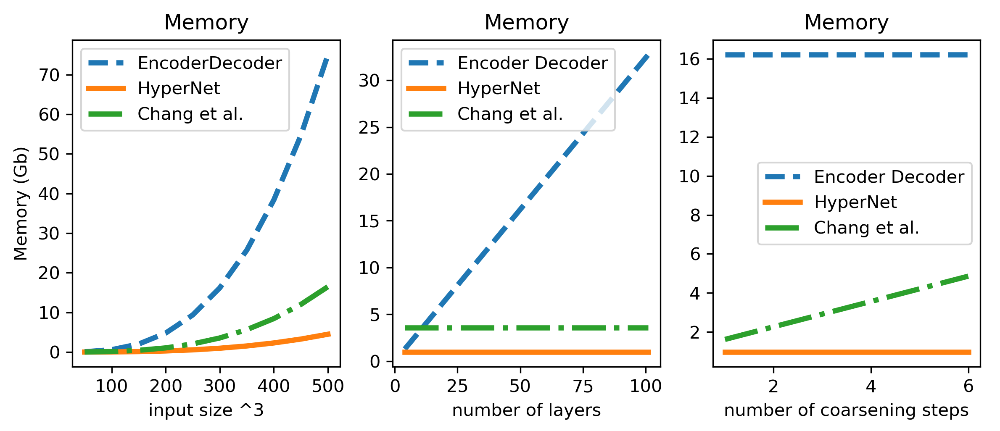
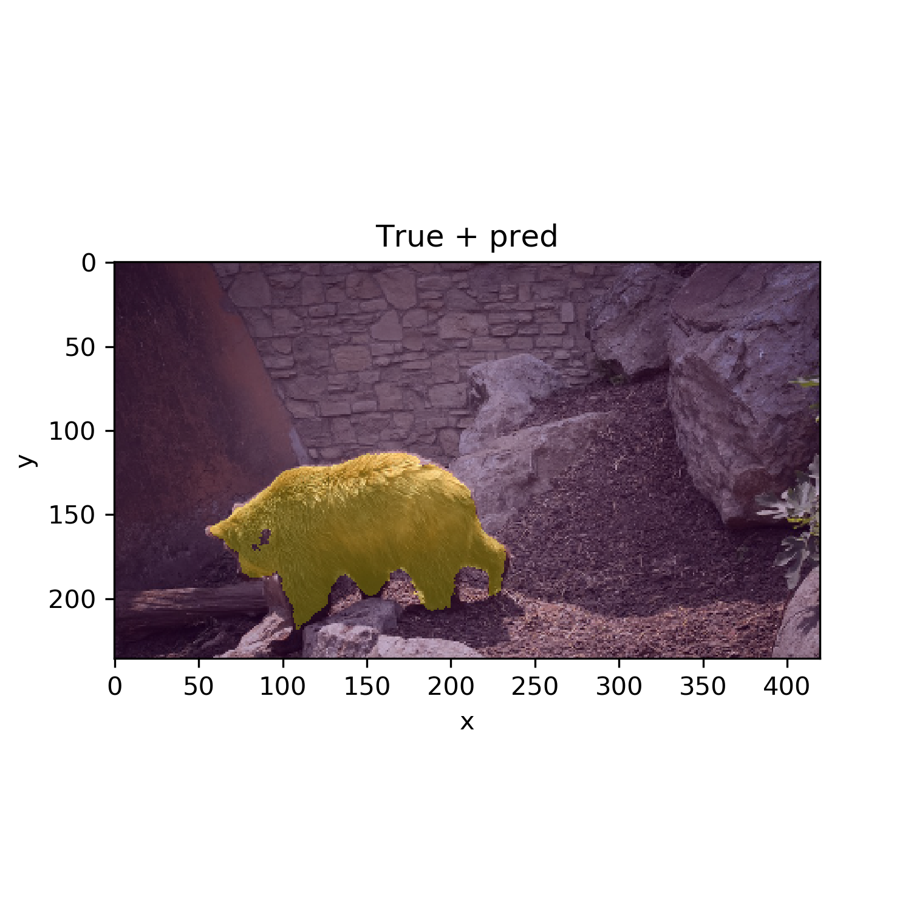
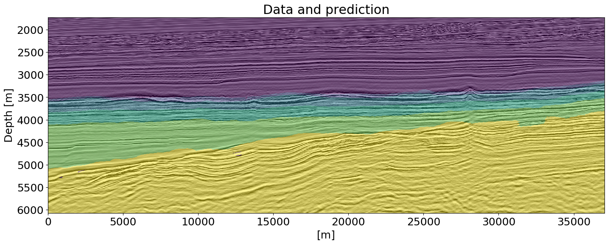

Bas Peters

- PhD, University of British Columbia (2019)
- MSc and BSc, Utrecht University, The Netherlands

[LinkedIn](https://www.linkedin.com/in/bas-peters-b26ba3a/) | [Google Scholar](https://scholar.google.ca/citations?user=gPVDmBEAAAAJ&hl=en&oi=ao) | [GitHub](https://github.com/PetersBas)

| ------------- | ------------- |
| Hi! I am a research scientist at [Computational Geosciences Inc.](https://www.compgeoinc.com) Before, I was a research scientist at Proteic Bioscience (currently [DiaGen Ai](https://diagen.ai)) in Vancouver BC. Previously, I was a visiting assistant professor (2020-2021) in the [mathematics department at Emory University](https://www.math.emory.edu/home/). Before that, I worked for [Computational Geosciences Inc.](http://www.compgeoinc.com) and I was a graduate student in the [SLIM](http://slim.gatech.edu) group at the University of British Columbia (currently at Georgia Tech).| 

My research interests include 

- [Non-convex optimization and energy functions for protein sequence and structure design]()
- [computational methods to design and train neural networks for large scale inputs](#computational-methods-for-training-neural-networks-for-large-scale-inputs)
- [constrained optimization for the regularization of inverse problems and neural networks](#constrained-optimization-for-regularizing-inverse_problems-&-neural-networks)
- [deep learning for computer vision applications in the geosciences and remote sensing](#Deep-learning-based-computer-vision-geoscience-and-remote-sensing_applications)
- [Numerical linear algebra and PDE-constrained optimization](#Numerical-linear-algebra-and-PDE-constrained-optimization)

## Teaching
Emory University: 

Fall 2020: [Linear Algebra MATH221](https://www.coursicle.com/emory/courses/MATH/221/) (all class info on Canvas)

Spring 2021: [Linear Algebra MATH221](https://www.coursicle.com/emory/courses/MATH/221/) (all class info on Canvas)

## Recent Publications
[in review: Fully invertible hyperbolic neural networks for segmenting large-scale surface and sub-surface data](https://arxiv.org/pdf/2407.00595). Bas Peters, Eldad Haber, Keegan Lensink
[in review: Paired Autoencoders for Inverse Problems](https://arxiv.org/pdf/2405.13220). Matthias Chung, Emma Hart, Julianne Chung, Bas Peters, Eldad Haber
[in review: InvertibleNetworks. jl: A Julia package for scalable normalizing flows](https://arxiv.org/pdf/2312.13480). Rafael Orozco, Philipp Witte, Mathias Louboutin, Ali Siahkoohi, Gabrio Rizzuti, Bas Peters, Felix J Herrmann.
[Fully hyperbolic convolutional neural networks](https://link.springer.com/article/10.1007/s40687-022-00343-1) Lensink, Keegan, Bas Peters, and Eldad Haber. Research in the Mathematical Sciences 9.4 (2022): 60. 
Point-to-set distance functions for output-constrained neural networks, Journal of Applied and Numerical Optimization 4 (2), 175-201, [A Special Issue on Projection and Splitting Methods and Their Applications](http://jano.biemdas.com/archives/category/volume-4-issue-2), Edited by Aviv Gibali, Pontus Giselsson, and Thomas Humphries. [pdf](Peters2022NetworkOutputConstraints.pdf)

Please see my [scholar page.](https://scholar.google.ca/citations?user=gPVDmBEAAAAJ&hl=en&oi=ao) for other publications.

## Recent & Upcoming Presentations
- Inverting airborne electromagnetic data with machine learning. Michael S McMillan, Bas Peters, Ophir Greif, Paulina Wozniakowska, Eldad Haber. Near Surface Geoscience Conference & Exhibition, Septermber 2024
- CQNet: convex-geometric interpretation and constraining neural-network trajectories. Bas Peters. SIAM Annual Meeting, August 2024
- GNflow: Fast Reinforcement Learning with Automatic Hyperparameter Tuning. Elizabeth Newman, Lars Ruthotto, Bas Peters. SIAM Conference on Optimization 2023.
- Gauss-Newton Flow for Q-Learning. Bas Peters, Lars Ruthotto. Mechanistic Machine Learning and Digital Twins for Computational Science, Engineering & Technology 2021.

## Selected Presentations
- Point-to-set distance functions for weakly supervised segmentation [poster](https://drive.google.com/file/d/1Kti65uLRwV98Pep96gtLTcAxSEFON-au/view?usp=sharing); [GEORGIA SCIENTIFIC COMPUTING SYMPOSIUM](https://sites.google.com/view/lin-mu/gscs21?authuser=0), Feb 2021.
- [The Weaker the Better: Weak Supervision for Training Neural Networks for Seismic Interpretation; an Approach via Constrained Optimization](https://www.gshtx.org/SharedContent/Events/Event_Display.aspx?EventKey=16ba1771-dc38-4322-a813-a17c94463b49&WebsiteKey=955f17e6-46ad-4401-acbd-2af6c393752b); [Data Science and Machine Learning special interest group Geophysical Society of Houston. October 28, 2020]
- [Constraints and optimization for weakly supervised deep-learning from few data and fewer labels](https://erlweb.mit.edu/events/fish-constraints-and-optimization-weakly-supervised-deep-learning-few-data-and-fewer-labels) MIT ERL FISH Seminar; October 23, 2020. [recording](https://youtu.be/K6-Pl9b2-9c?si=KGPxL8cPR68XNReI)
- [Scientific Computing Seminar, Emory University](http://www.mathcs.emory.edu/site/scicomp/schedule/); Oct 16, 2020.
- A vision approach to mineral prospectivity mapping using reversible neural networks [Workshop on Machine Learning/Artificial Intelligence in Mineral Exploration; Society of Exploration Geophysicists Annual Meeting; Thursday, Oct 15, 2020]
- Shortcutting inversion-based near-surface characterization workflows using deep learning [Special Session on Machine Learning in the Near Surface; Society of Exploration Geophysicists Annual Meeting; Oct 13, 2020]
- Deep connections between learning from limited labels & physical parameter estimation - inspiration for regularization, [Visual Learning with Limited Labels workshop at CVPR 2020](https://www.learning-with-limited-labels.com/program).
- [Fully Reversible Neural Networks for Large-Scale Surface and Sub-Surface Characterization via Remote Sensing, AI for Earth Sciences workshop at ICLR 2020](https://ai4earthscience.github.io/iclr-2020-workshop/) [video](https://slideslive.com/38926360/fully-reversible-neural-networks-for-largescale-surface-and-subsurface-characterization-via-remote-sensing)
- Novel deep learning architectures and problem formulations for the geosciences. Department of Earth, Ocean and Atmospheric Sciences Seminar; University of British Columbia. Monday, March 9, 2020.
- Scientific Computing, Applied and Industrial Mathematics (SCAIM) Seminar Series, UBC, October 29 2019 [slides](https://www.slideshare.net/BasPeters11/learning-from-a-few-largescale-partial-examples-computational-tools-regularization-and-network-design?qid=63f82a0e-9ee2-4a61-8cbb-94cb844e9a00&v=&b=&from_search=1)
- Does shallow geological knowledge help neural-networks to predict deep units? [Society of Exploration Geophysicists, Annual meeting 2019]
- A numerical solver for least-squares sub-problems in 3D wavefield reconstruction inversion and related problem formulations [Society of Exploration Geophysicists, Annual meeting 2019]
- Automatic classification of geologic units in seismic images using partially interpreted examples [81st EAGE Conference and Exhibition 2019]
- Generalized Minkowski sets for the regularization of inverse problems (SIAM Conference on Mathematical and Computational Issues in the Geosciences, 2019) [video](https://www.pathlms.com/siam/courses/11267/sections/14618/video_presentations/128671) [slides](https://cdn.fs.pathlms.com/WpyqzDxDQmazQeMb3KRu)
- Networks, loss-functions, regularization, and software for machine learning in the geosciences [Machine learning in solid earth geoscience, hosted by Los Alamos National Laboratory in Santa Fe, 2019]

## Optimization and energy functions for protein design

## Computational methods for training neural networks for large scale inputs
Collaborators: Keegan Lensink & Eldad Haber. Research focusses on developing fully reversible and invertible networks that have constant memory requirements as a function of network depth. This topic also includes methods for training networks in a 'factorized' form to reduce the memory required for weights.

[Fully Hyperbolic Convolutional Neural Networks](https://arxiv.org/pdf/1905.10484)
[Symmetric block-low-rank layers for fully reversible multilevel neural networks](https://arxiv.org/abs/1912.12137)

Applications include video segmentation, (time-lapse) hyperspectral land use classification and generative modeling. The low memory requirements of the fully reversible network allows us to segment a full video in one go. The following example segments a full video, based on three given slices.

## Deep-learning based computer vision geoscience and remote sensing applications
Collaborators: Eldad Haber & Justin Granek. For this project we develop deep learning methods to be able to apply deep neural-networks to geoscience problems. We worked on techniques to deal with 

- training deep networks on data with sparse labels
- including prior knowledge via regularization of the output of a network while training in order to mitigate a lack of labels
- learning from datasets that consist of a single (large-scale) example

| ------------- | ------------- |
|  Applications include aquifer mapping using topography, gravitational, magnetic data, as well as various geological maps and point observations of the ground truth. |  |

| Time-lapse hyperspectral imaging maps a 4D input to a 2D maps of the suface of the earth, in terms of land-use change. |   |

2D/3D geological model building from seismic images and borehole data (labels)

[Automatic Classification of Geologic Units in Seismic Images Using Partially Interpreted Examples](http://www.earthdoc.org/publication/publicationdetails/?publication=97269) / [arXiv](https://arxiv.org/pdf/1901.03786)

[Neural-networks for geophysicists and their application to seismic data interpretation](https://library.seg.org/doi/10.1190/tle38070534.1) / [arXiv](https://arxiv.org/pdf/1903.11215)

[Does shallow geological knowledge help neural-networks to predict deep units?](https://library.seg.org/doi/10.1190/segam2019-3216640.1) / [arXiv](https://arxiv.org/pdf/1904.04413)

| ------------- | ------------- |
| Detecting horizons (interfaces) of interest in seismic images. There are a number of training images and each has a few labels (seed points). Our method performs better than methods not based on learning, especially in areas where there are large gaps in the labels.  |   |

[Multiresolution neural networks for tracking seismic horizons from few training images](https://library.seg.org/doi/10.1190/INT-2018-0225.1) / [arXiv](https://arxiv.org/pdf/1812.11092)

## Constrained optimization for regularizing inverse problems & neural networks
Collaborator: Felix J. Herrmann. 

We incorporate prior knowledge into the inverse problems via a projection of a vector onto an intersection of multiple convex and non-convex sets. Each sets may include a different linear operator, such as discrete derivative matrices, Fourier/DCT/wavelet/curvelet transforms. The projection approach has the advantage that each sets is defined independently of all others; no trade-off/balancing parameters are required. Julia software is available as the [SetIntersectionProjection](https://petersbas.github.io/SetIntersectionProjectionDocs/) package. Applications include image/video processing and non-convex geophysical parameter estimation problems.

Reconstructing images from noisy, blurred, and missing pixels. Shows basis-pursuit denoise using wavelets, versus our method (PARSDMM): projection onto an intersection of constraint sets that were learned from examples.

 - [Algorithms and software for projections onto intersections of convex and non-convex sets with applications to inverse problems (preprint)](https://arxiv.org/pdf/1902.09699)
 - [Projection methods and applications for seismic nonlinear inverse problems with multiple constraints](https://library.seg.org/doi/abs/10.1190/geo2018-0192.1)
 - [Constraints versus penalties for edge-preserving full-waveform inversion](https://library.seg.org/doi/abs/10.1190/tle36010094.1) / [preprint](https://www.slim.eos.ubc.ca/Publications/Public/Journals/TheLeadingEdge/2016/peters2016cvp/peters2016cvp.pdf)
 - [Constrained Waveform Inversion of Colocated VSP and Surface Seismic Data](http://www.earthdoc.org/publication/publicationdetails/?publication=80659) / [preprint](https://www.slim.eos.ubc.ca/Publications/Public/Conferences/EAGE/2015/smithyman2015EAGEcwi/smithyman2015EAGEcwi.pdf)

In case it is difficult to describe a model/image using a set or intersection of sets as above, we can use an additive model. Therefore, we introduced a generalization of the Minkowski set, which allows us to construct a 'complicated' model/image from two 'simple' ones. We can add multiple pieces of prior knowledge about each component as well multiple constraints on their sum. In spirit, this approach generalized ideas from cartoon-texture decomposition, robust prinipal component analysis, and morphological component analysis. Julia software is available to set up constraints sets and compute the [projection onto the Generalized Minkowski Set](https://petersbas.github.io/GeneralizedMinkowskiSetDocs/).

[Generalized Minkowski sets for the regularization of inverse problems (preprint)](https://arxiv.org/pdf/1903.03942)

## Software

[SetIntersectionProjection](https://petersbas.github.io/SetIntersectionProjectionDocs/)

 - Julia, uses worker parallelism and multithreading
 - Simple way of setting up constraints. Software will provide a projector onto the intersection
 - Use projector for any suitable optimization problem
 - Contains example of full-waveform inversion, image inpainting/deblurring/denoising, image desaturation
 - Tested for computational domains of up to ``400^3``
 
 
[Generalized Minkowski Set projections](https://petersbas.github.io/GeneralizedMinkowskiSetDocs/)

 - This is an extension of SetIntersectionProjection
 - Build 'complicated' models from simple ones, via the addition and intersection of constraint sets
 - Software will provide a projector onto the Generalized Minkowski set
 - Contains examples of seismic full-waveform inversion and video segmentation.

## Numerical linear algebra and PDE-constrained optimization
Collaborators: Felix J. Herrmann & Tristan van Leeuwen

We investigated how and when quadratic penalty methods offer andvantages over reduced-Lagrangian (adjoint-state) methods for non-convex seismic PDE-constrained optimization problems, in terms of the quality of the solution. 

[Wave-equation Based Inversion with the Penalty Method-Adjoint-state Versus Wavefield-reconstruction Inversion](https://www.earthdoc.org/content/papers/10.3997/2214-4609.20140704)/[preprint](https://www.slim.eos.ubc.ca/Publications/Public/Conferences/EAGE/2014/peters2014EAGEweb/peters2014EAGEweb.pdf)
[A new take on FWI-wavefield reconstruction inversion](https://www.earthdoc.org/content/papers/10.3997/2214-4609.20140703)/[preprint](https://www.slim.eos.ubc.ca/Publications/Public/Conferences/EAGE/2014/leeuwen2014EAGEntf/leeuwen2014EAGEntf.pdf)

We also did some work in numerical linear algebra, aimed at seismic parameter estimation problems. We developed a sparse hessian approximation for quadratic-penalty method sub-problems that arise from estimating two different physical parameters simultaneously. This leads to challenges because different physical parameters can have scalings that are orders of magnitudes apart.

[A sparse reduced Hessian approximation for multi-parameter wavefield reconstruction inversion](https://library.seg.org/doi/abs/10.1190/segam2014-1667.1)/[preprint](https://slim.gatech.edu/Publications/Public/Conferences/SEG/2014/peters2014SEGsrh/peters2014SEGsrh.pdf)

I developed a solver for block-structured least-squares problems, with slightly more rows than columns. These problems arise when solving for the states/fields when reduced quadratic-penalty methods are employed for time-harmonic PDE-constrained optimization problems. This is the first work that solves such problems in 3D and is based on a identity+low-rank factorization & Sherman-Morrison-Woodbury.

[A numerical solver for least-squares sub-problems in 3D wavefield reconstruction inversion and related problem formulations](https://library.seg.org/doi/abs/10.1190/segam2019-3216638.1)/[preprint](https://slim.gatech.edu/Publications/Public/Conferences/SEG/2019/peters2019SEGans/peters2019SEGans.pdf)

[Parallel reformulation of the sequential adjoint-state method](https://library.seg.org/doi/abs/10.1190/segam2016-13966771.1)/[preprint](https://slim.gatech.edu/Publications/Public/Conferences/SEG/2016/peters2016SEGprs/peters2016SEGprs.pdf)